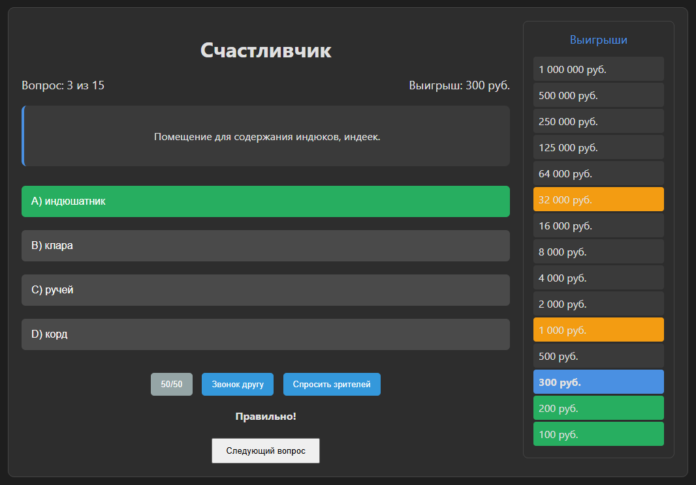

# 🎮 Счастливчик — Игра в стиле "Кто хочет стать миллионером?" на 11309 вопросов
**Случайные вопросы из внешнего файла | Тёмная тема | Подсказки | Аудио-дружелюбный интерфейс**

---

## ✨ Описание

Это интерактивная веб-игра в стиле *"Кто хочет стать миллионером?"*, полностью реализованная на чистом HTML, CSS и JavaScript.  В базе присутствует 11309 тысяч вопросов.
Игра загружает базу вопросов из внешнего файла `questions.js`, что позволяет легко расширять её без правки кода.  
Вопросы перемешиваются случайным образом при каждом запуске.  
Интерфейс — тёмная тема с современным дизайном, соответствующий предпочтениям пользователя:  

- **Arial и Segoe UI**  
- **Круглые углы, отступы, светло-синие акценты**  
- **Многострочная навигация и чёткая визуальная иерархия**

Идеально подходит для локального использования, обучения, или как основа для мобильного приложения.

---

## 📁 Структура проекта

lucky-game/
│
├── lucky.html # Главный HTML-файл игры
├── questions.js # База вопросов (легко редактируется!)
├── README.md # Этот файл
└── assets/ # (Опционально) Изображения
---

## ⚙️ Как запустить

1. Скачайте или клонируйте репозиторий:
2. Откройте файл lucky.html в любом современном браузере (Chrome, Firefox, Edge).
3. Готово! Игра запустится автоматически.

💡 Важно: Не открывайте файл через file:// в Safari — могут быть ограничения. Лучше запустить локальный сервер:

python -m http.server 8000

и откройте http://localhost:8000

## 📚 База вопросов (questions.js)
Все вопросы хранятся в отдельном файле questions.js в формате:

const originalQuestions = [
  {
    question: "Какой химический элемент обозначается символом 'O'?",
    answers: {
      A: "Золото",
      B: "Кислород",
      C: "Олово",
      D: "Осмий"
    },
    correct: "B"
  },
  // ... добавляйте сколько угодно!
];

🔹 Преимущества:

Легко добавлять, удалять или редактировать вопросы в любом текстовом редакторе.
Можно автоматизировать импорт из CSV, JSON или базы данных.
Поддерживает до 15 вопросов в одной сессии (настраивается в коде).

## 🎯 Особенности игры
✅ Случайные вопросы
Каждый запуск — новый порядок вопросов (алгоритм Фишера-Йетса).
✅ Тёмная тема
Удобно для длительного использования.
✅ Подсказки
50/50, Звонок другу, Спросить зрителей — как в оригинальной игре.
Гарантированные суммы
После 5-го и 10-го вопросов выигрыш не падает до нуля.
✅ Таблица выигрышей
Визуальное отображение прогресса и гарантированных сумм.
✅ Адаптивный интерфейс
Работает на ПК и планшетах.
✅ Нет баз данных
Всё работает локально — без сервера, без регистрации.

📧 Контакты: hexxeh777-svg — не стесняйтесь писать!

📜 Лицензия
MIT — свободно для личного и образовательного использования.

Если используете в коммерческих целях — дайте ссылку на этот репозиторий. ❤️
